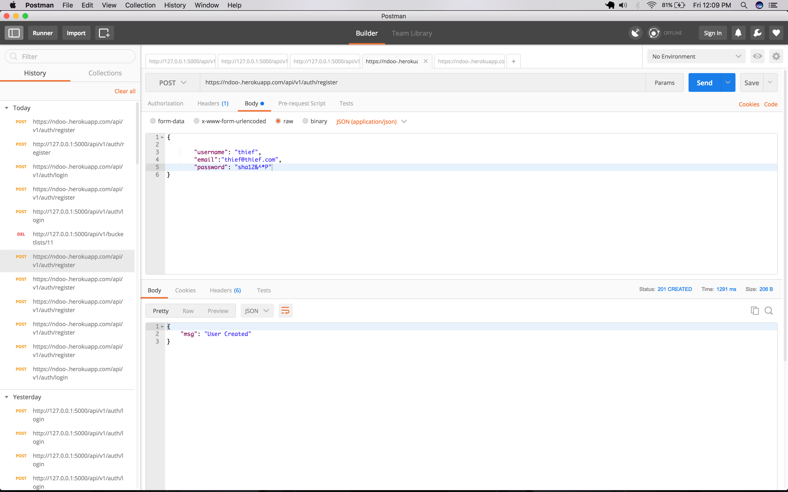
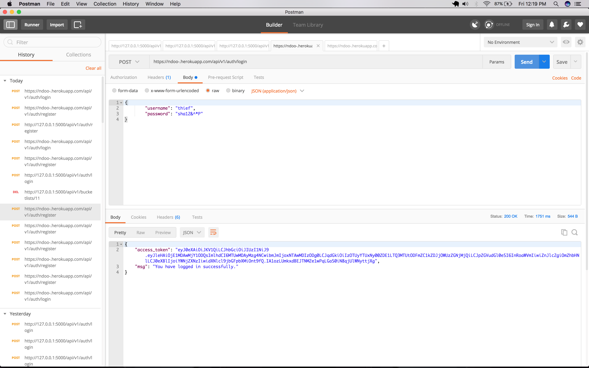
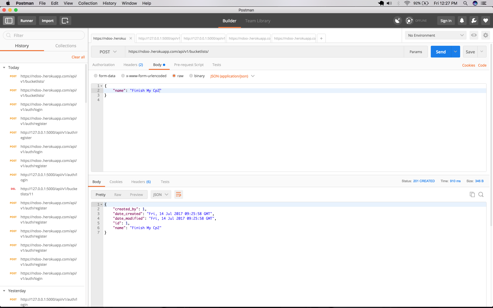
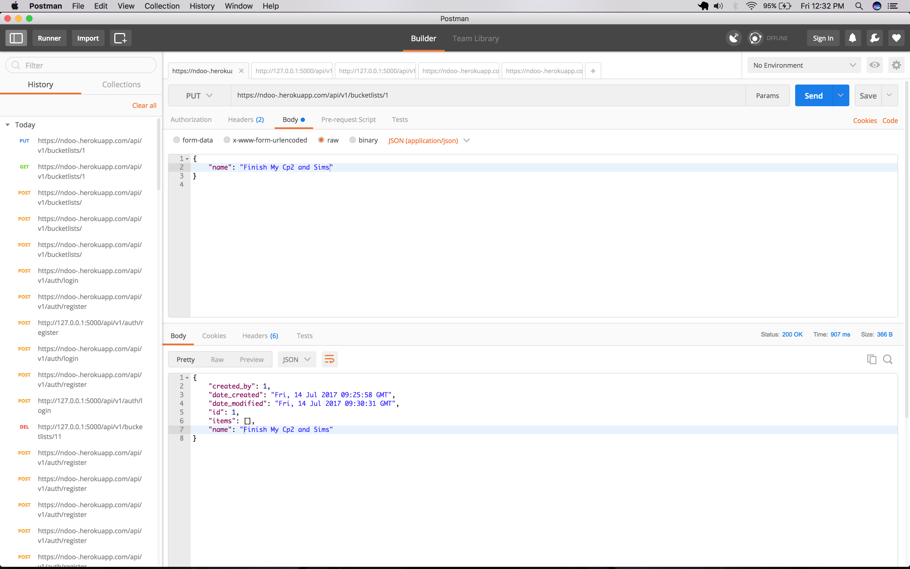
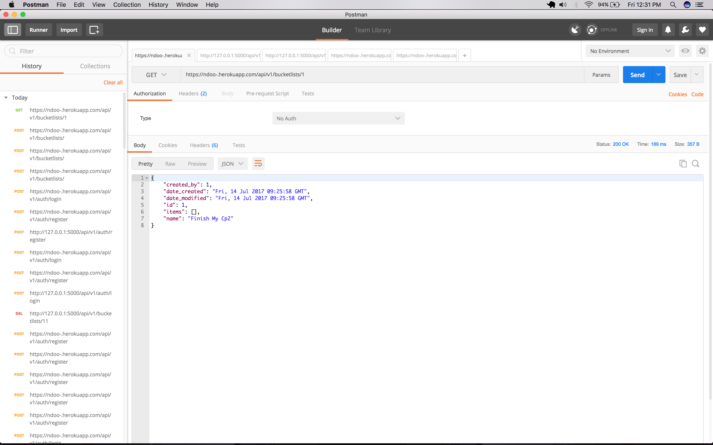
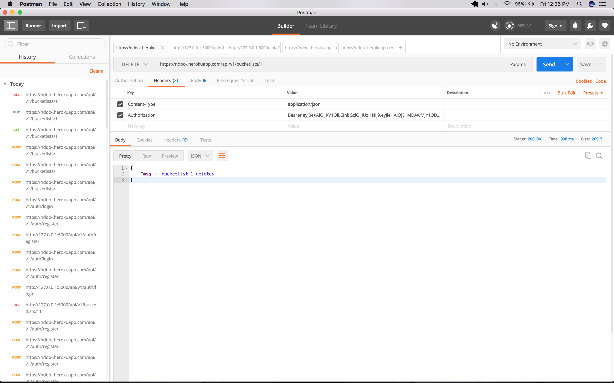

[](https://coveralls.io/github/Kachulio1/Cp2?branch=dev)
[](https://travis-ci.org/Kachulio1/Cp2)

# BucketList-Application
 Create an API for an online Bucket List service using Flask.


## Getting Started

These instructions will get you a copy of the project up and running on your local machine for development and testing purposes. See deployment for notes on how to deploy the project on a live system.

### API documentation
The API has been documented using apiblueprint and the online version can be found [here](https://ndoo-.herokuapp.com/)

## SCOPE

|Method | Endpoint | Usage |
| ---- | ---- | --------------- |
|POST| `/api/v1/auth/register` |  Register a user. |
|POST| `/api/v1/auth/login` | Login user.|
|POST| `/api/v1/bucketlists/` | Create a new bucket list. |
|GET| `/api/v1/bucketlists/` | Retrieve all the created bucket lists. |
|GET| `/api/v1/bucketlists/<bucket_id>` | Get a single bucket list. |
|PUT| `/api/v1/bucketlists/<bucket_id>` | Update a single bucket list. |
|DELETE| `/api/v1/bucketlists/<bucket_id>` | Delete single bucket list. |
|POST| `/api/v1/bucketlists/<bucket_id>/items` | Add a new item to this bucket list. |
|PUT|`/api/v1/bucketlists/<bucket_id>/items/<item_id>` | Update this bucket list. |
|DELETE|`/api/v1/bucketlists/<bucket_id>/items/<item_id>` | Delete this single bucket list. |
|GET| `/api/v1/bucketlists?per_page=10&page=1` | Pagination to get 10 bucket list records.|
|GET| `/api/v1/bucketlists?q=a bucket` | Search for bucket lists with name like a bucket. 

### INSTALLATION & SET UP.

1. Clone the project on github: 

2. Checkout into the develop branch using ```git checkout develop```

3. Create a ***virtual environment*** and start the virtual environment

4. Install the dependencies via ```pip install -r requirements.txt```

**Setup Database:**

Install postgres ```brew install postgresql```

1. ```type psql in terminal.```

2. ```On postgres interactive interface, type CREATE DATABASE bucketlist;```

3. ```source .env```

**Run the Migrations**:
1. ```python manage.py db init```

2. ```python manage.py db migrate```

3. ```python manage.py db upgrade```

4. ```Flask Run```
> The server should be running on [http://127.0.0.1:5000] 


End with an example of getting some data out of the system or using it for a little demo


## Running the tests

Explain how to run the automated tests for this system

### Break down into end to end tests

Explain what these tests test and why

```
Give an example
```

### And coding style tests

Explain what these tests test and why

```
Give an example
```

## Deployment

Add additional notes about how to deploy this on a live system

### ScreenShots

User Register


User Login


Bucket Create


Update Bucket 


Get A Bucket


Delete A Bucket


## Built With

* [Flask](http://flask.pocoo.org/) - The web framework used

## Contributing

Please read [CONTRIBUTING.md](https://gist.github.com/PurpleBooth/b24679402957c63ec426) for details on our code of conduct, and the process for submitting pull requests to us.

## Versioning

We use [SemVer](http://semver.org/) for versioning. For the versions available, see the [tags on this repository](https://github.com/your/project/tags).

## Authors

* **_Joseph Ngugi_** - *Initial work* - [Amity]


## License

This project is licensed under the MIT License - see the [LICENSE.md](LICENSE.md) file for details

## Acknowledgments

* Hat tip to anyone who's code was used
* Inspiration
* etc
